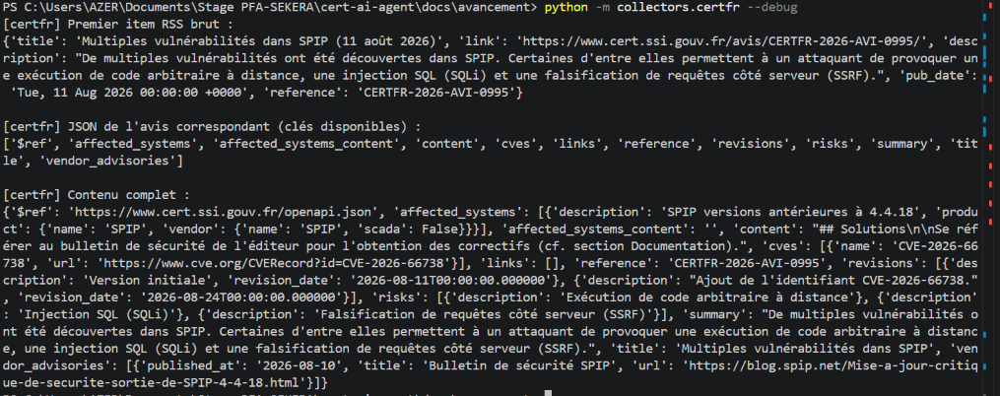
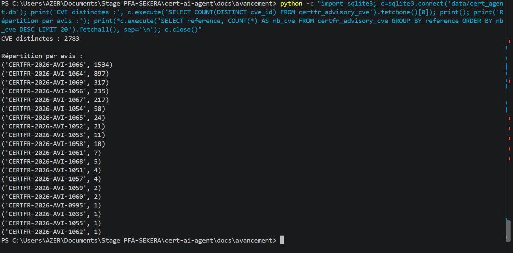
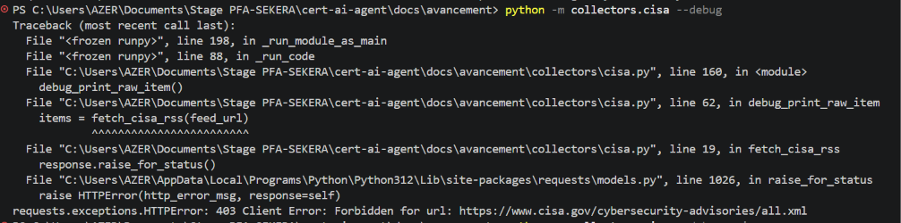
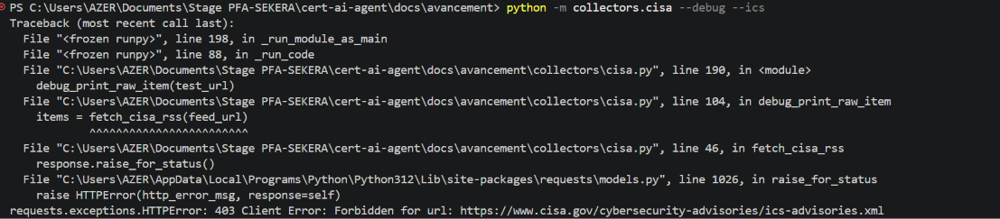
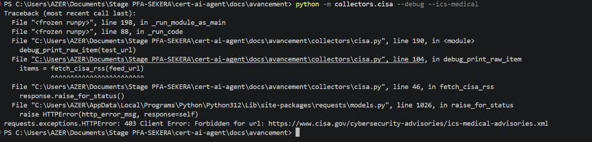
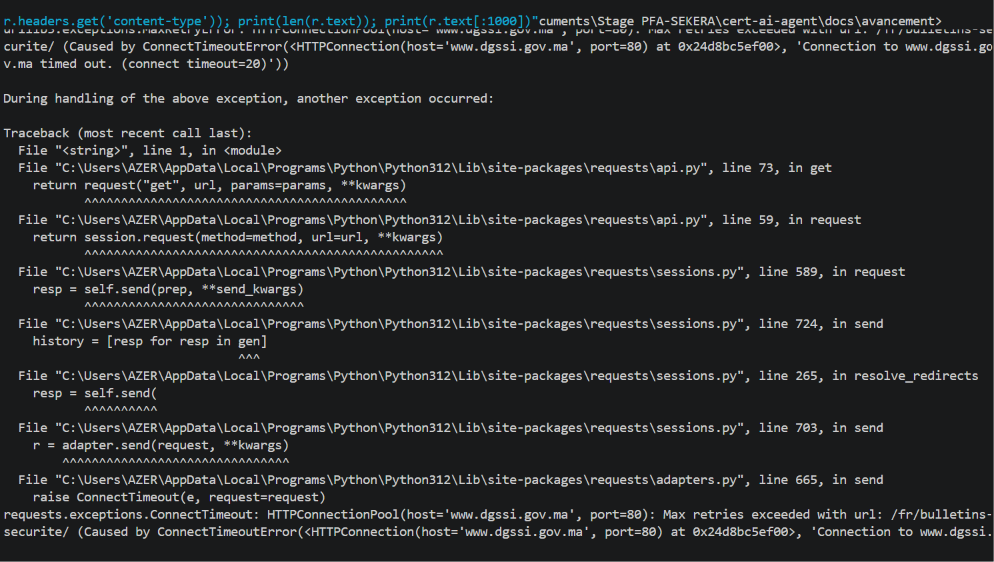

# Semaine 4 — Intégration multi-sources CTI

## 1. Objectif

Jusqu'à la Semaine 3, le pipeline ne collectait des vulnérabilités que depuis une seule source : **NIST NVD**. Le sujet du projet insiste explicitement sur le fait qu'un CERT doit croiser plusieurs sources officielles de Cyber Threat Intelligence, et non se reposer sur une seule plateforme, aussi complète soit-elle. L'objectif de cette semaine était donc d'étendre la collecte à trois sources supplémentaires identifiées avec l'encadrant : **CERT-FR**, **CISA Advisories** et **MA-CERT**.


## 2. Refonte du modèle de données : traçabilité multi-source

Avant d'ajouter une deuxième source, il a fallu revoir la structure de la base de données. Une première approche envisagée était d'ajouter une simple colonne `source` dans la table `cve`. Cette approche a été écartée : une même CVE peut être publiée par plusieurs sources en parallèle (par exemple NVD **et** CERT-FR), et une colonne unique ne permet pas de représenter cette réalité.

La structure retenue repose sur une relation many-to-many :

```
cve ──┬── cve_sources ──┬── sources
      │  (cve_id,        │  (id, name)
      │   source_id,     │
      │   first_seen_at) │
```

Cette table permet de répondre à des questions comme *"cette CVE a-t-elle été vue par plusieurs sources ?"* ou *"quelle source a été la première à publier cette CVE ?"*, ce qui a un vrai intérêt pour un CERT (délai de propagation entre sources).

### Règle de fusion des données

Pour éviter qu'une source secondaire, moins riche en données structurées, n'écrase les informations plus fiables de NVD (score CVSS notamment), une logique de fusion a été mise en place dans `upsert_cve()` :

| Source | Rôle | Comportement |
|---|---|---|
| **NVD** | Primaire | Fait autorité sur les champs communs (description, CVSS, dates) — les écrase sans condition |
| **CERT-FR / CISA / MA-CERT** | Secondaire | Ne complète que les champs vides (`COALESCE`) ; ne touche jamais `published_date` d'une CVE déjà existante |

Les produits affectés et les références sont ajoutés (pas remplacés) quelle que soit la source, pour ne perdre aucune information apportée par l'une ou l'autre.

### Séparation des données propres à un avis

Les informations spécifiques à un avis (résumé, risques, solutions, documentation) ne sont pas mélangées à la table `cve`, qui reste réservée aux données communes de la vulnérabilité. Chaque source avec ce type de contenu dispose de sa propre table d'avis, reliée aux CVE via une table de jonction (un avis peut couvrir plusieurs CVE) :

```
certfr_advisories ── certfr_advisory_cve ── cve
cisa_advisories   ── cisa_advisory_cve   ── cve
```

## 3. Connecteur CERT-FR — intégré avec succès

### Découverte du format réel

Le flux RSS des avis CERT-FR (`https://www.cert.ssi.gouv.fr/avis/feed/`) donne accès, pour chaque avis, à une représentation JSON structurée (`https://www.cert.ssi.gouv.fr/avis/{reference}/json/`). Un test de diagnostic (`--debug`) a permis de confirmer la structure réelle du JSON, différente des hypothèses initiales :

- `cves` : liste structurée `{name, url}` — extraction fiable, sans regex
- `affected_systems[].product.name` / `.vendor.name` : structure imbriquée (pas de champ CVSS ni de version structurée)
- `content` : texte Markdown libre contenant les solutions (pas de champ `solutions` dédié)
- `vendor_advisories` : liens vers les bulletins éditeurs (fait office de documentation)



### Résultat du test réel

Sur un échantillon de 20 avis récents :
- **2 783 CVE distinctes** traitées



- Distribution vérifiée et expliquée : deux avis concentrent à eux seuls plus de 2 400 CVE (bulletins noyau Linux Ubuntu et SUSE, qui corrigent légitimement des centaines de vulnérabilités par version)
- Fusion multi-source confirmée : plusieurs CVE apparaissent avec `sources = NVD,CERT-FR`, avec le score CVSS correctement préservé (issu de NVD, jamais écrasé par CERT-FR)


## 4. Connecteur CISA Advisories — source écartée

Le flux RSS initialement identifié (`https://www.cisa.gov/cybersecurity-advisories/all.xml`) renvoie une erreur `403 Forbidden`. Une recherche a permis de confirmer que **CISA a supprimé ses flux RSS pour les advisories et le catalogue KEV en mai 2025**, sans mettre en place d'alternative machine-readable officielle — les mises à jour passent désormais uniquement par email et réseaux sociaux.



Les flux spécialisés ICS (`ics-advisories.xml`, `ics-medical-advisories.xml`) ont également été testés sans succès.






**Décision** : cette source est écartée du pipeline de collecte actif. CISA reste toutefois intégré au projet via son **catalogue KEV** (JSON, toujours disponible), déjà utilisé depuis la Semaine 1 pour confirmer l'exploitabilité active d'une vulnérabilité (`kev_checker.py`).

## 5. Connecteur MA-CERT — source écartée

MA-CERT publie ses bulletins de sécurité via une page web simple (`dgssi.gov.ma/fr/bulletins-securite`), sans flux RSS ni API JSON identifiable. Une vérification du fichier `robots.txt` du site a révélé que **l'accès automatisé y est explicitement interdit**.



**Décision** : par respect des règles posées par le site, aucun scraping n'a été mis en place pour cette source. Elle reste documentée comme source officielle pertinente pour le sujet, mais non intégrable dans un pipeline automatisé sans accès dédié (partenariat institutionnel, accès API réservé aux administrations, etc. — à clarifier éventuellement avec l'encadrant).

## 6. Bilan des sources CTI

| Source | Statut | Rôle dans le pipeline |
|---|---|---|
| NIST NVD | ✅ Intégrée (primaire) | Source principale : CVE, CVSS, produits affectés |
| CISA KEV | ✅ Intégrée | Confirmation d'exploitabilité active (`exploit_public`) |
| CERT-FR | ✅ Intégrée (secondaire) | Enrichissement multi-source, contexte français |
| CISA Advisories | ❌ Écartée | Flux RSS supprimé par CISA (mai 2025), aucune alternative officielle |
| MA-CERT | ❌ Écartée | Pas de flux structuré ; `robots.txt` interdit l'accès automatisé |

## 7. Ce que cette étape a permis d'apprendre

- Une architecture multi-source doit être pensée dès la structure de la base de données (relation many-to-many), pas ajoutée après coup
- Toutes les sources "officielles" citées dans un sujet ne sont pas forcément exploitables techniquement (formats non documentés, changements récents) ou dans le respect des règles du site (`robots.txt`)
- Documenter une source écartée, avec preuve à l'appui, a autant de valeur que d'en intégrer une nouvelle — ça reflète une vraie démarche de vérification plutôt qu'une intégration non critique

## 8. Prochaine étape

Semaine 5 — Agent décisionnel : l'agent doit devenir autonome dans sa logique (nouvelle CVE → critique ? → qui est concerné ? → créer la fiche → envoyer le mail), en s'appuyant sur le pipeline multi-source construit cette semaine.